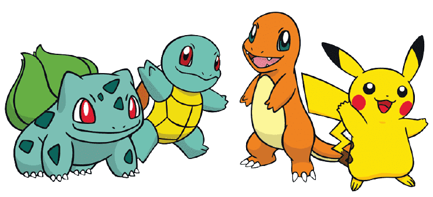

# Research Project - Sketchformer (VICG)
## Server Information



The VICG server is comprised of 6 different subservers, each with its own resources.

```
articuno : 04 CPU cores : 64GB RAM  : 1x 1080 Ti
moltres  : 04 CPU cores : 32GB RAM  : 1x 1080
zapdos   : 04 CPU cores : 64GB RAM  : 1x 1080 Ti
mew      : 06 CPU cores : 32GB RAM  : 2x 1070
mewtwo   : 28 CPU cores : 64GB RAM  : 2x 2080 Ti
pikachu  : 10 CPU cores : 128GB RAM : 2x Titan RTX
```

